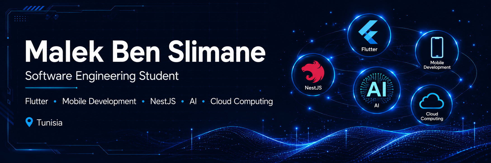

```md
<p align="center">
  
</p>

<h1 align="center">Hi 👋 I'm Malek Ben Slimane</h1>

<h3 align="center">Software Engineering Student @ ESPRIT 🇹🇳</h3>

<p align="center">
Flutter • NestJS • AI • Cybersecurity • Mobile Development
</p>

<p align="center">

</p>

---

# 👩‍💻 Portfolio Identity

🎓 2nd Year Software Engineering Student at ESPRIT

📱 Passionate about Mobile Development and User Experience

🌐 Full Stack Development with NestJS, Symfony and Modern Web Technologies

🤖 Interested in Artificial Intelligence and Intelligent Systems

🔐 Learning Cybersecurity and Cloud Computing

🐳 Docker & DevOps Enthusiast

🇹🇳 Based in Tunisia

---

# ⚡ Tech Galaxy

<p align="center">

</p>

---

# 🚀 Featured Projects

## 🧩 CogniCare

A smart platform dedicated to supporting children with autism through collaboration between families, specialists and volunteers.

**Stack:** Flutter • NestJS • MongoDB • AI

---

## ✈️ WayFinder

Travel assistance platform featuring authentication, profile management, booking APIs and real-time notifications.

**Stack:** Android • iOS • NestJS • Docker • MongoDB

---

## 🚗 CovoiMob

Carpooling platform developed using Symfony for web, JavaFX for desktop and FlutterFlow for mobile.

**Stack:** Symfony • JavaFX • MySQL

---

## ⚙️ Industrial Quality Control System

Automated packaging and quality control system based on PIC16F877 microcontroller.

**Stack:** Embedded C • Proteus ISIS

---

# 🛠 Tech Stack

### Languages

`Java` `Dart` `JavaScript` `TypeScript` `C` `C++` `C#`

### Backend

`NestJS` `Spring Boot` `Symfony` `Node.js`

### Mobile

`Flutter` `Android` `iOS`

### Databases

`MySQL` `MongoDB`

### Tools

`Git` `GitHub` `Docker` `Linux`

---

# 🌍 Languages

🇹🇳 Arabic — Native

🇫🇷 French — B2

🇬🇧 English — B2

🇩🇪 German — A2

---

# 📊 GitHub Analytics

<p align="center">


</p>

---

# 🏆 Achievements

<p align="center">

</p>

---

# 📫 Contact

📧 malek.benslimen@esprit.tn

🌍 Tunisia

💻 GitHub: github.com/Malek6196

---

<p align="center">
⭐ Always learning, always building.
</p>
```
